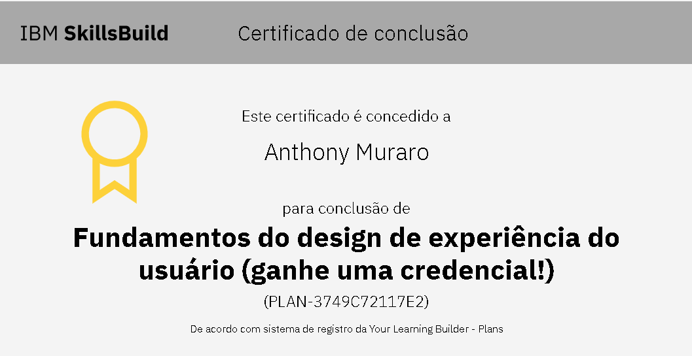
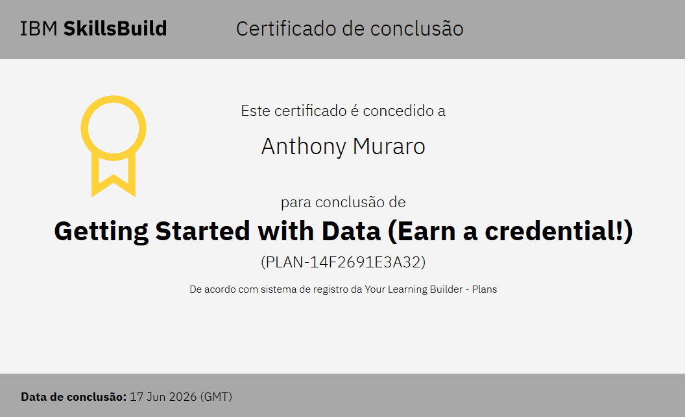
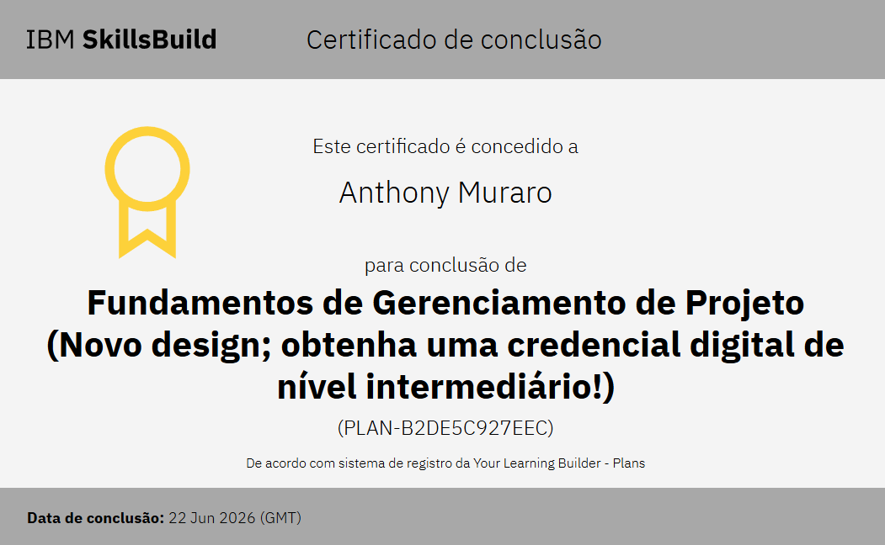

<h1 align="center">Oii, eu sou Anthony Muraro  </h1>
<h3 align="center">Estudante de Informática para a Internet | Back-End</h3>

<p align="center">
  <a href="mailto:thonymuraro@gmail.com"></a>
</p>


<div align="left">
<fieldset style="border: 2px solid #F82A94; border-radius: 10px; padding: 20px; max-width: 800px;">
  <legend align="left"><h3>😁👍 Sobre Mim</h3></legend>

  <em>
Sou um estudante de <strong>Informática para a Internet</strong> na <strong>Escola Técnica Vasco Antônio Venchiarutti</strong>. Minha jornada na tecnologia começou com o ensino médio técnico, o que me deu uma base sólida que hoje aplico com foco em desenvolvimento de sites.</p>
  </em> 
  <br>
<div align= "center">
   <b><i>Tecnologias em aprendizado</i></b> 
</div>

<h1 align="center"> 💳 Certificados</h1>

<div align="center">

<a href=https://skills.yourlearning.ibm.com/certificate/share/3f2285e7fdewogICJvYmplY3RJZCIgOiAiUExBTi0xNEYyNjkxRTNBMzIiLAogICJvYmplY3RUeXBlIiA6ICJBQ1RJVklUWSIsCiAgImxlYXJuZXJDTlVNIiA6ICI4MDI1Nzc1UkVHIgp932872f43ec-10>
    
</a>

<a>
    
</a>

<a href="#">
    
</a>

<a>
    
</a>
</div>

<br>
  
<p style="display: inline-block;" align="center">
   <kbd>
    <kbd>Back-end</kbd>
    <br>
    <br>
    
  </kbd>
  <kbd>
    <kbd>Front-end</kbd>
    <br>
    <br>
     
    
  </kbd>
  <br>
  <p align="center">
</div>

<h2> 🤝 Grupo ACDK </h2>

```yaml
grupo:
  "ACDK"

descrição:
  "Grupo acadêmico voltado para projetos, atividades e estudos do curso INFONET."

disciplinas:
  [
    "Desenvolvimento Web",
    "Banco de Dados",
    "Arte Digital",
    "Programação e Algoritmos",
  ]
```

<p align="center">
  <a href="https://github.com/ACDK-ETECVAV">
    
  </a>
</p>

<br>
<br>

- 📫 Contato: **thonymuraro@gmail.com**

<p align="center"> 
